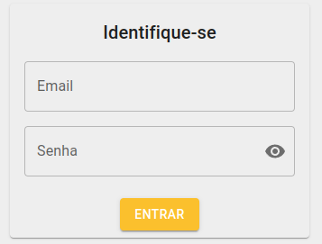
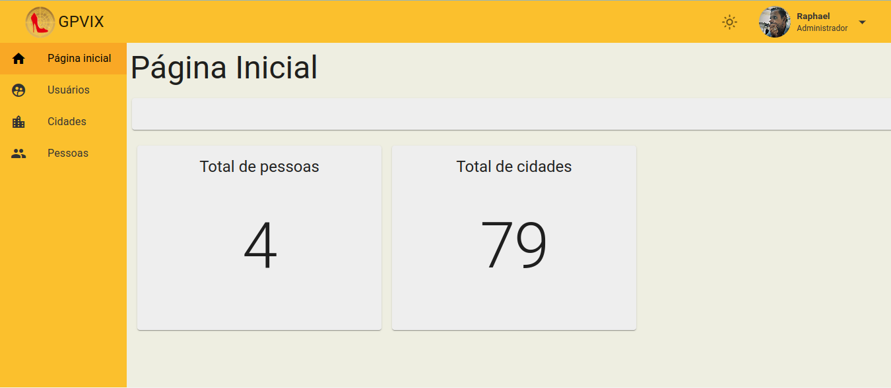

# Dashboard GPVIX
---
<h2>Descrição do Projeto</h2>
<p>
Este projeto é um painel administrativo de uma aplicação Web onde cadastramos:
</p>

- **Usuários:** Que terão niveis administrativos diferentes para gerir a aplicação.
- **Pessoas:** Onde cadastramos os clientes com Nome, email e Cidade. Este último campo está relacionado com as cidades cadastradas.
- **Cidades:** Onde cadastramos as cidades.

Aplicação desenvolvida para consolidar meus estudos sobre React, Material UI, chamadas API. Importante pontuar desde já que este projeto Front-End faz parte de uma solução integrada a um Back-End chamado [API GPVIX](https://github.com/RaphaelOhlsen/api-gpvix2). Se houver interesse na solução completa aconselho a iniciar a implementação de sua solução com a implementação do Back-End. Instruções serão fornecidas abaixo para integrar este Front-End com o Back-End.


<p align="justify">
Temos uma tela de autenticação para acesso ao painel administrativo onde utilizamos os recursos de Local Storage do navegador web, recebemos as informações de tipo de usuário que define o que é visualmente apresentado para o usuário no painel administrativo e o access token que vem criptografado que será usado para ter acesso as rotas mais especificas que precisam não só de autenticação como autorização em nossa aplicação back-end já comentada.
</p>

<h1 align="center">
  
</h1>

<p align="justify">Abaixo temos a imagem da tela inical do painel administrativo:</p>

<h1 align="center">
  
</h1>

O projeto está em produção e este é o link para a aplicação [Dashboard](https://starfish-app-wyn79.ondigitalocean.app/). Caso queira acesso temporário a aplicação entre em [contato](https://mocad.dev/#contato).

Caso queira acesso à aplicação com níveis diferentes de usuário entre em contato comigo através do email **raphael@mocad.dev** ou utilize o formulário que se encontra no final da pagina principal do meu site [Mocad.dev](https://mocad.dev/#contato).

---
<h2>Pré-requisitos</h2>

Antes de começar, você vai precisar ter instalado em sua máquina as seguintes ferramentas:
[Git](https://git-scm.com) e [React](https://pt-br.reactjs.org/).
Além disto é bom ter um editor para trabalhar com o código como [VSCode](https://code.visualstudio.com/).

---
# 🧩 Integração com Back-End 
Renomeie o arquivo **.env.example** que se encontra no diretório raiz para **.env**. Em seguida insira o endereço onde está hospedado o seu Back-End. Como no exemplo abaixo.
```bash
REACT_APP_API_URL='http://127.0.0.1:3333'
```

---
# 🎲 Rodando o Front-End


```bash
# Clone este repositório
$ git clone https://github.com/RaphaelOhlsen/dashboard-gpvix.git

# Acesse a pasta do projeto no terminal/cmd
 cd dashboard-gpvix

# Instale as dependências
$ yarn

# Execute a aplicação em modo de desenvolvimento
$ yarn start

# O servidor inciará na porta:3000 - acesse <http://localhost:3000>

```
---
<a id="-autor"></a>
## 👨‍💻 Autor
Olá, meu nome é Raphael Ohlsen, Engenheiro de Telecomunicações | BackEnd e FrontEnd Developer. Em transição de carreira de Telecom para Developer que é minha verdadeira paixão. Sou aficcionado por tecnologia e programação. Dúvidas, sugestões e críticas são super bem vindas. Seguem meus contatos.

- [www.mocad.dev](https://mocad.dev)
- [raphael@mocad.dev](raphael@mocad.dev)

<p align="center">Redes Sociais</p>
<p align="center">
  <a href= "https://github.com/RaphaelOhlsen"></a>
  <a href= "https://www.linkedin.com/in/raphael-bernardo-ohlsen-79115689/"></a>
</p>

